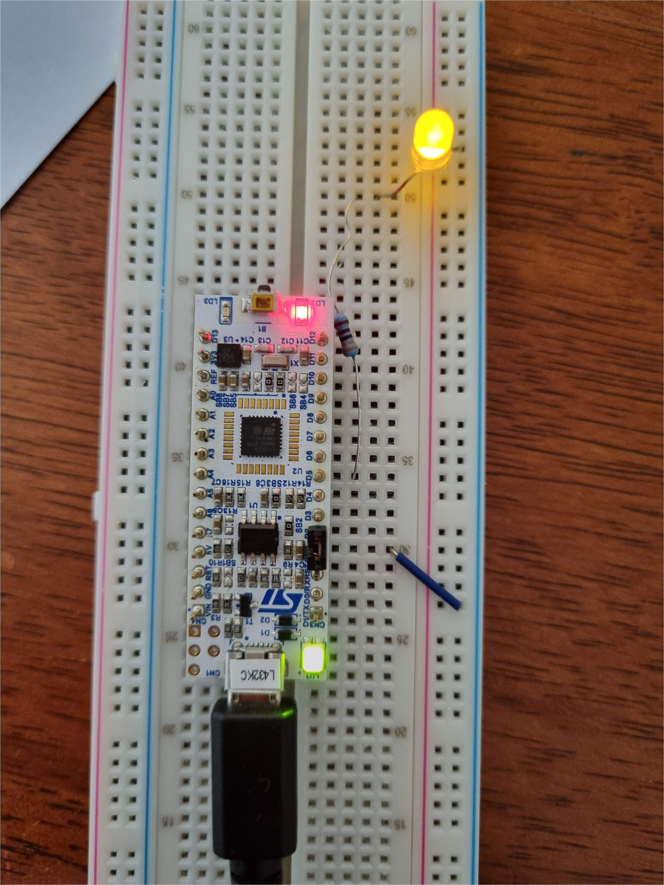

# Blinky using a PAC in Rust
The disassembly shows there is a similar amount of instructions compared to the disassembly of the C and ASM from scratch code. Some other observations:
- There seems to be no literal pools
- The write instructions generate no LDRs because the reset value is written to the unwritten fields. This is documented behaviour.

## Circuit (for future reference)

